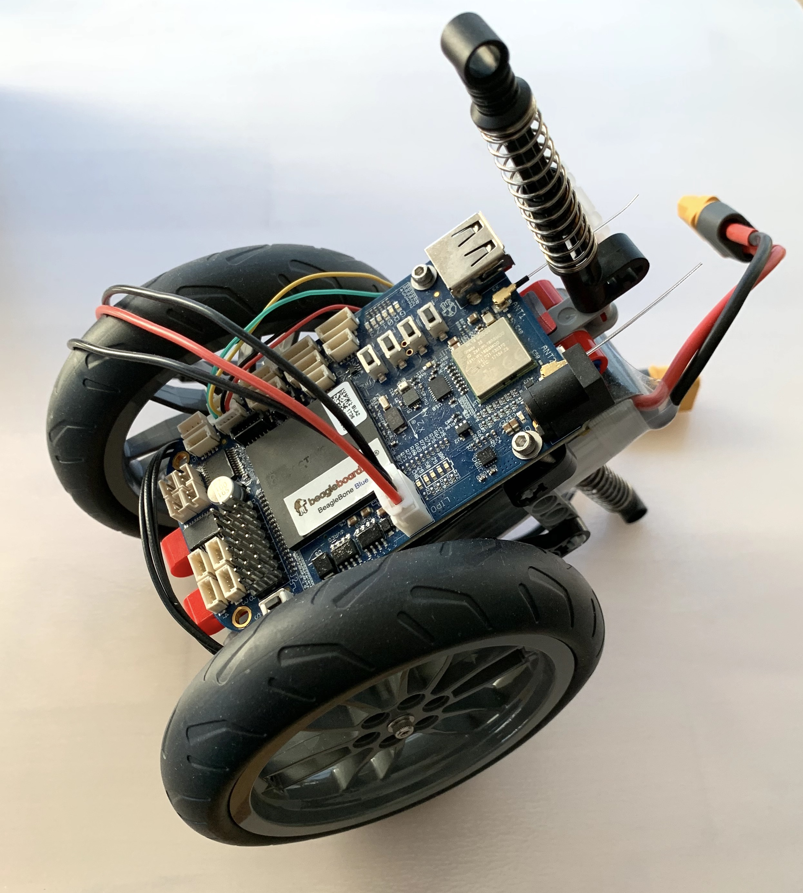

# EDI

A balancing robot. Testing rust bindings to C code and async/await syntax.
Based on the beaglebone blue board.



## Build

```
cross build --target armv7-unknown-linux-gnueabihf
```

## Deploy

```
scp target/armv7-unknown-linux-gnueabihf/debug/hello debian@beaglebone.local:/home/debian/
```

### Debugging

IDE via wifi
```
http://192.168.6.2/ide.html
```

```
sudo /etc/init.d/networking restart
```

## Docs

- http://strawsondesign.com/docs/librobotcontrol
